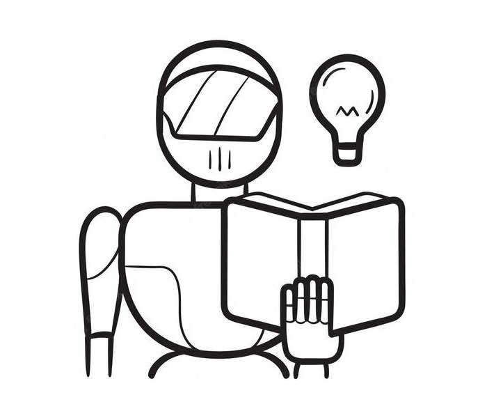

# Introduction to Artificial Neural Networks

  

Artificial intelligence should be made accessible to all. To this end, we provide a spelled-out introduction to artificial neural networks and their applications for students from all disciplines, regardless of their background or area of study. Starting with the classical problem of image recognition, students will delve into the intricacies of modeling multilayer perceptrons, backpropagation algorithm for optimization, model training and evaluation, as well as extensions and variants of the basic architecture. By empowering students with hands-on modeling and programming skills, we aim to democratize AI technology and foster a community of `AI ninjas' capable of harnessing its transformative potential for innovation, economic growth, and the betterment of humanity.

## Class Information

* [Fall 2024 Syllabus](/pdf/E6930syllabus.pdf)
* **Location:** Cook Hall 240
* **Time:** TR 12:45pm-2:00pm
* **Office hours:** TR 2:00pm-3:00pm & by appointment
* **Discord:** [discord.gg/SsrNPEeP2P](https://discord.gg/SsrNPEeP2P)
* **TA:** [openai.com/blog/chatgpt](https://openai.com/blog/chatgpt)
* **Zoom:** [slu.zoom.us/my/econdojo](https://slu.zoom.us/my/econdojo)
* **GitHub Classroom:** [classroom.github.com](https://classroom.github.com)

## Lecture Slides

TBA

## Computer Science Fundamentals

* [Lecture 1: Introduction to Algorithms](/pdf/Ch1_IntroToAlgorithms.pdf)
* [Lecture 2: Recursion](/pdf/Ch2_Recursion.pdf)
* [Lecture 3: Stacks and Queues](/pdf/Ch3_StacksAndQueues.pdf)
* [Lecture 4: Binary Trees](/pdf/Ch4_BinaryTrees.pdf)
* [Lecture 5: Heaps](/pdf/Ch5_Heaps.pdf)
* [Lecture 6: Graphs](/pdf/Ch6_Graphs.pdf)
* [Lecture 7: Strings](/pdf/Ch7_Strings.pdf)
* [Repository of data structures in C](https://github.com/econdojo/c-data-struct)
* [Repository of algorithms in C++](https://github.com/econdojo/cpp-algo)
